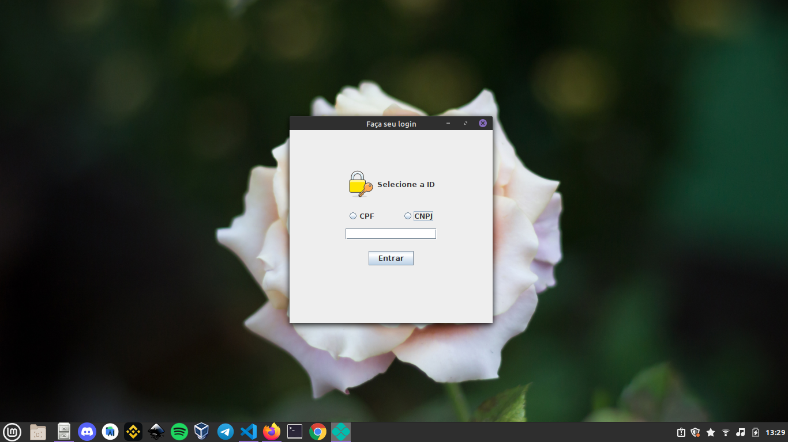
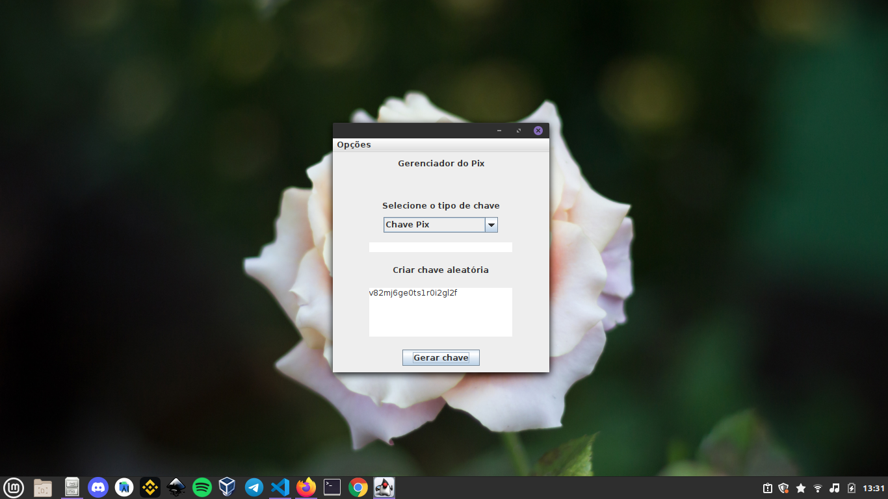
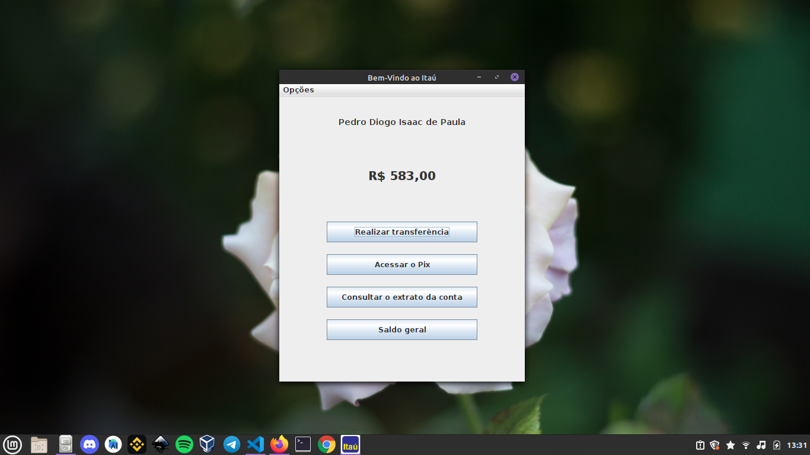
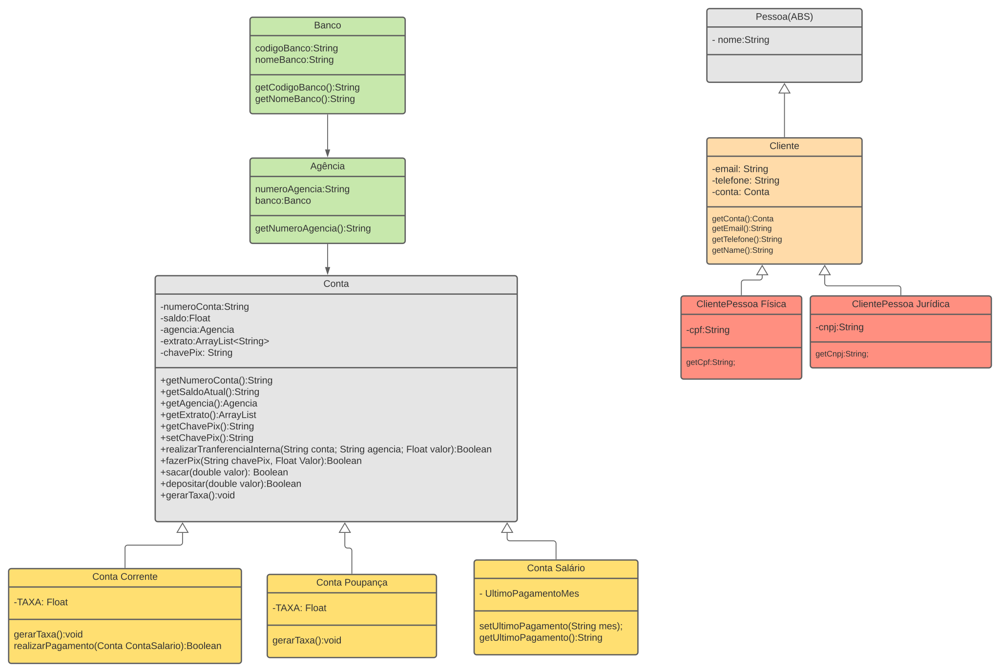

# Projeto POO da Unidade 2 - Sistema Bancária
### Descrição do projeto
A partir de novembro, o Banco Central determinou que todas as contas bancárias do
Brasil possam fazer transferências usando PIX. Dessa forma, é preciso criar um
módulo onde os bancos possam manipular os dados dos clientes e do próprio Banco
Central.
## Telas

## Bibliografia
- [Java®: Como Programar 📚](https://www.amazon.com.br/Java%C2%AE-como-programar-Paul-Deitel/dp/8543004799/ref=asc_df_8543004799/?tag=googleshopp00-20&linkCode=df0&hvadid=379748659420&hvpos=&hvnetw=g&hvrand=7458101882819761644&hvpone=&hvptwo=&hvqmt=&hvdev=c&hvdvcmdl=&hvlocint=&hvlocphy=1001715&hvtargid=pla-811137648368&psc=1)

- [Object-Oriented Programming and Java (English Edition) 2nd Edição 📚](https://www.amazon.com.br/Object-Oriented-Programming-Java-English-Danny-ebook/dp/B00192QXTK)

## Artigos
- [Alura 📃](https://www.alura.com.br/artigos/mascarando-campos-de-um-formulario-usando-java-para-desktop)
- [DEV Media 📃](https://www.devmedia.com.br/orientacao-a-objetos-simples-assim/3254)
- [Programcreek 📃](https://www.programcreek.com/2011/03/java-appendadd-something-to-an-existing-file/)
- [Icons - Education License 😛](https://iconscout.com/)

## Ferramentas De Desenvolvimento
- [Vs Code 💻](https://code.visualstudio.com/)
  - Version: 1.53.0

- [Java JDK 11 🍵](https://www.oracle.com/br/java/technologies/javase-jdk11-downloads.html)
  - Openjdk 11.0.9.1

- [Lucid 🖼](https://lucid.app/documents#/dashboard)

- [Notion 📓](https://www.notion.so/)

- [How Todo In Java 📃](https://howtodoinjava.com/java/library/json-simple-read-write-json-examples/)
## UML
